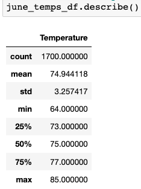

# surfs_up
## Overview
W. Avy is planning to open a new surf and ice cream shop. He would like us to find more info about the temperature trends before he opens his shop to see if it can be a year around shop. To do this he wants us to look at June and December to see if the temperature is still in a good range to that ice cream would sell.
## Results
Three key differences in the temperature data between the months of June and December are:
- The biggest take away we got was that there was almost 2,000 more reading in June than there was in December.
    - June had 1,700 readings
    - December had 1,517 readings
- The temperatures are over lower in December than they are in June
    - December's averager temp is around 71
    - June's average temp is around 75  
                  
- the temperatures in December can go up or down by 27 degrees (56 to 83), whereas june is 21 degrees (64 to 85)
## Sumarry
From the data that we got we would say it would work to have a year around shop. When you are looking at the average it is only 4 degrees difference between the two months. I think it would also be a good thing to run a couple queries to get all the data we can.
  1. A query that looks at what are the temps between the hours we are open. this would be beneficial because you could always set your hours to when the weather is most profitable.
  2. A query that looks at precipitation in each month because with ice cream you are not only worried about the temps but if it is rain most of the time.
